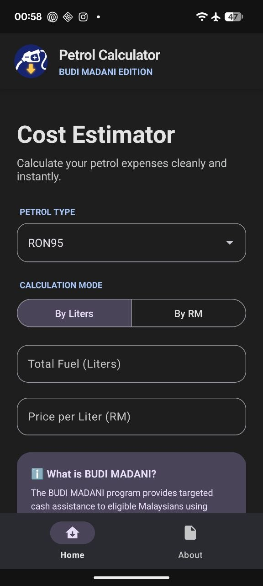
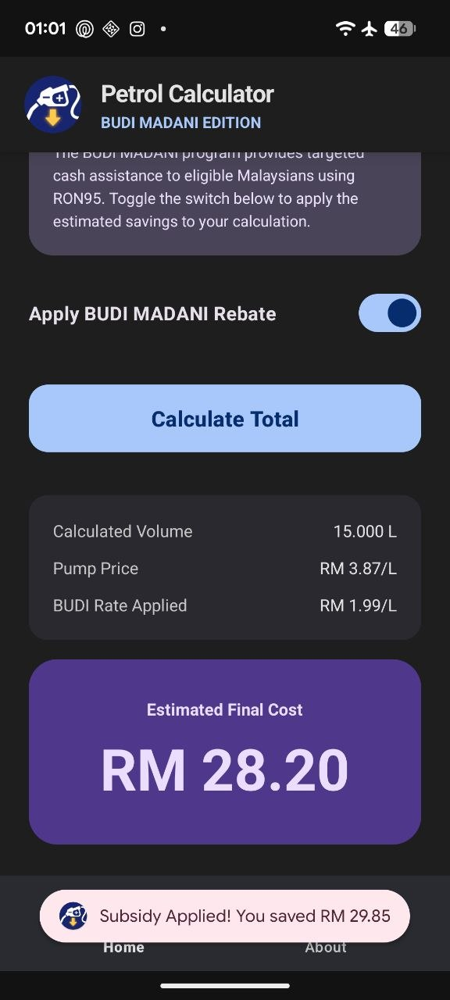
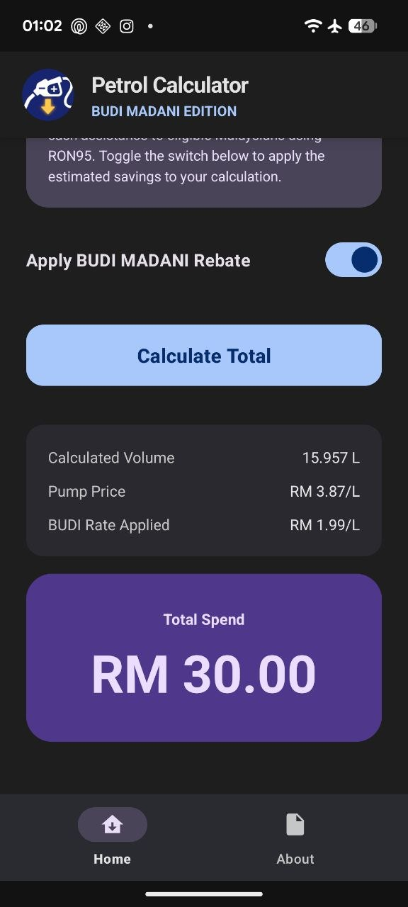
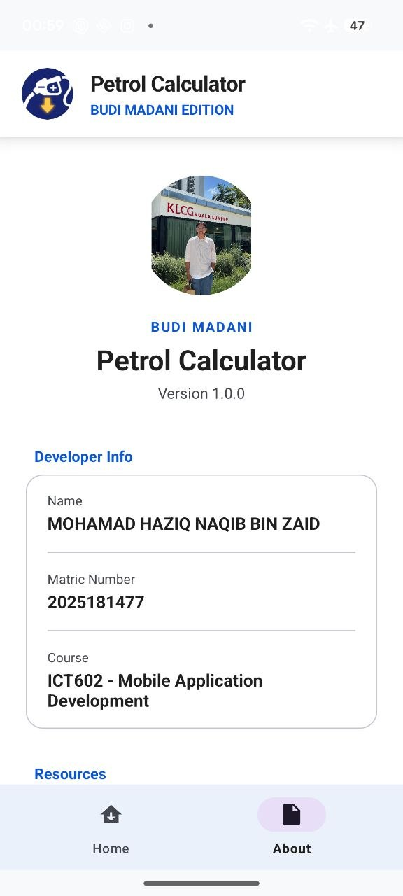

# ⛽ Smart Petrol Cost Calculator (BUDI MADANI Edition)

A modern, minimalist Android application designed to calculate petrol expenses and dynamically apply the **BUDI MADANI** government subsidy. Developed for **ICT602 - Mobile Application Development**.

## ✨ Key Features
* **Modern Material 3 UI:** Clean, minimalist interface with dynamic receipt breakdowns.
* **Dual Calculation Modes:** Users can calculate by exact fuel volume (Liters) or by cash spent (RM) using reverse-calculation algorithms.
* **Instant BUDI MADANI Integration:** One-tap toggle to instantly apply the RM 1.99/L targeted subsidy.
* **Dynamic Receipt Generation:** A hidden summary card seamlessly expands to show exact pumped volume, pump price, and applied rates.

---

## 📱 App Screenshots

  
  
  
  

---

## 🧮 Core Calculation Engine & Logic

To provide a real-world user experience, this app utilizes two distinct mathematical approaches depending on how the user inputs their data at the petrol station.

### 1. "By Liters" Mode (Standard Calculation)
This mode calculates the total cost based on a known physical volume of fuel.
* **Total Cost** = `Fuel Volume (L) × Pump Price (RM)`
* **BUDI Rebate** = `Fuel Volume (L) × RM 1.99` *(If RON95 & Eligible)*
* **Effective Payable** = `Total Cost - BUDI Rebate`

### 2. "By RM" Mode (Reverse-Volume Algorithm)
In Malaysia, users frequently purchase fuel by a fixed currency amount (e.g., "Isi RM30"). This mode performs a reverse-calculation to determine the actual volume of fuel dispensed into the tank, factoring in instant point-of-sale subsidies.
* **Effective Pump Price** = `Pump Price (RM) - BUDI Subsidy (RM 1.99)`
* **Calculated Volume (L)** = `Total Cash Spent (RM) ÷ Effective Pump Price`
* *Result:* The app accurately demonstrates that applying the BUDI subsidy allows the same RM 30 note to purchase a significantly larger physical volume of fuel.

---

## 🛠️ Tech Stack
* **Language:** Java
* **UI/UX:** XML, Material Design Components (MDC-Android)
* **Architecture:** Android Fragment-based navigation
* **IDE:** Android Studio

---

## 👨‍💻 Developer Profile
* **Name:** Mohamad Haziq Naqib bin Zaid
* **Student ID:** 2025181477
* **Course:** ICT602 - Mobile Application Development
* **Institution:** Universiti Teknologi MARA (UiTM)